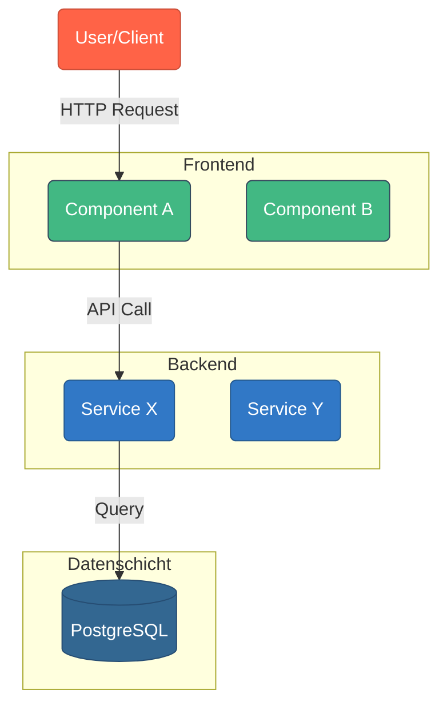

# Mermaid-Diagramm mit Claude Code generieren

> Extrahiert aus der [GitDiagram](https://github.com/ahmedkhaleel2004/gitdiagram) 3-Stufen-Pipeline und zu einem einzigen Claude-Code-Prompt konsolidiert.

---

## Schnellstart

Kopiere den Prompt unten und verwende ihn direkt in Claude Code, während du dich im Root-Verzeichnis deines Projekts befindest.

---

## Der Prompt

```
Analysiere dieses Repository und erzeuge ein Mermaid.js System-Design-Diagramm der Architektur.

Gehe dabei in drei Schritten vor:

### Schritt 1: Repository-Analyse

Lies den File-Tree (über `find . -type f` oder Glob) und die README. Analysiere:

1. **Projekttyp & Zweck** — Full-Stack-App, CLI-Tool, Library, Compiler, Microservices, etc.
2. **Dateistruktur** — Top-Level-Verzeichnisse, Architektur-Patterns (MVC, Hexagonal, Monorepo, etc.), Config-Dateien, Build-Skripte.
3. **README** — Tech-Stack, beschriebene Architektur, Abhängigkeiten, Features.
4. **Hauptkomponenten** — Frontend, Backend, Datenbank, externe Services, Message Queues, etc.
5. **Beziehungen** — Datenfluss, API-Aufrufe, Abhängigkeiten zwischen Komponenten.

### Schritt 2: Component Mapping

Mappe jede identifizierte Komponente auf die konkreten Dateien/Verzeichnisse im Repo:

- Fokus auf Hauptkomponenten aus der Analyse.
- Sowohl Verzeichnisse als auch spezifische Dateien inkludieren.
- Wenn keine klare Zuordnung existiert, die Komponente weglassen.

Format:
```
1. [Komponenten-Name]: [Datei-/Verzeichnispfad]
2. [Komponenten-Name]: [Datei-/Verzeichnispfad]
...
```

### Schritt 3: Mermaid-Diagramm erzeugen

Erzeuge validen Mermaid.js-Code nach diesen Regeln:

**Struktur:**
- Verwende `flowchart TD` (top-down) oder `graph TD`.
- Orientiere das Diagramm **so vertikal wie moeglich**. Vermeide lange horizontale Ketten.
- Gruppiere zusammengehoerige Komponenten in `subgraph`-Bloecken.
- Verwende passende Formen: Rechtecke fuer Services, Zylinder fuer Datenbanken, etc.
- Zeige Datenfluss/Abhaengigkeiten mit Pfeilen und beschrifteten Kanten.

**Click Events (interaktiv):**
- Fuer jede gemappte Komponente einen Click-Event mit dem Repo-Pfad einfuegen.
- Nur den relativen Pfad verwenden, keine vollstaendigen URLs.
- Beispiel: `click Frontend "src/app"`
- Die Pfade duerfen NICHT in den sichtbaren Node-Labels auftauchen — nur in Click-Events.

**Farben & Styles:**
- Farbcodierung ist Pflicht! Verwende `classDef` fuer verschiedene Komponenten-Typen.
- Beispiel:
  ```
  classDef frontend fill:#42b883,stroke:#35495e,color:#fff
  classDef backend fill:#3178c6,stroke:#265a8f,color:#fff
  classDef database fill:#336791,stroke:#264d73,color:#fff
  classDef external fill:#ff6347,stroke:#cc4f39,color:#fff
  ```

**Syntax-Regeln (KRITISCH — Mermaid-Parser ist streng):**
1. Sonderzeichen in Node-Labels MUESSEN in Anfuehrungszeichen stehen:
   - Falsch: `EX[/api/process (Backend)]:::api`
   - Richtig: `EX["/api/process (Backend)"]:::api`
2. Keine `:::class` auf Subgraph-Deklarationen:
   - Falsch: `subgraph "Frontend":::frontend`
   - Richtig: `subgraph "Frontend"` (Style auf Nodes innerhalb anwenden)
3. Keine Leerzeichen zwischen Pipe und Anfuehrungszeichen bei Kanten-Labels:
   - Falsch: `A -->| "text" | B`
   - Richtig: `A -->|"text"| B`
4. Keine Subgraph-Aliase:
   - Falsch: `subgraph FE "Frontend"`
   - Richtig: `subgraph "Frontend"`
5. Kein `%%{init: ...}%%` Block — weglassen.
6. Keine Markdown-Code-Fences um den Output.

**Ausgabe-Template:**



Schreibe den fertigen Mermaid-Code in eine Datei namens `ARCHITECTURE.mmd`.
```

---

## Verwendung

### Direkt in Claude Code

```bash
# Im Root-Verzeichnis des Projekts:
claude "$(cat DIAGRAM_PROMPT.md)"

# Oder interaktiv:
claude
> Lies DIAGRAM_PROMPT.md und fuehre die Anweisungen darin aus.
```

### Als CLAUDE.md-Anweisung

Fuege folgendes zu deiner `CLAUDE.md` hinzu, damit Claude Code auf Anfrage Diagramme erzeugt:

```markdown
## Diagramm-Generierung

Wenn der User ein Architektur-Diagramm anfragt, lies die Datei `DIAGRAM_PROMPT.md`
und befolge die Anweisungen darin. Schreibe das Ergebnis nach `ARCHITECTURE.mmd`.
```

### Ausgabe validieren

Die erzeugte `.mmd`-Datei kann so validiert werden:

```bash
# Mit npx (kein Install noetig)
npx @mermaid-js/mermaid-cli mmdc -i ARCHITECTURE.mmd -o ARCHITECTURE.svg

# Oder mit installiertem mermaid-cli
mmdc -i ARCHITECTURE.mmd -o ARCHITECTURE.svg
```

Falls Syntax-Fehler auftreten, kann Claude Code den Fix-Schritt ausfuehren:

```
Der Mermaid-Code in ARCHITECTURE.mmd hat folgenden Parser-Fehler:
<error hier einfuegen>

Behebe den Syntax-Fehler, ohne die Diagramm-Bedeutung zu aendern.
Behalte alle Click-Events und die vertikale Orientierung bei.
Gib nur den korrigierten Mermaid-Code zurueck.
```

---

## Hinweise

- **Kosten**: GitDiagram nutzt 3 separate LLM-Aufrufe, um Tokens zu sparen. Claude Code hat direkten Zugriff auf das Repo, daher ist ein einzelner Prompt effizienter.
- **Qualitaet**: Die Diagramm-Qualitaet haengt stark von der Groesse und Dokumentation des Repos ab. Gut dokumentierte Projekte mit klarer Verzeichnisstruktur liefern die besten Ergebnisse.
- **Interaktivitaet**: Die `click`-Events in Mermaid erzeugen klickbare Nodes. In einem Browser-Renderer (z.B. GitHub-Preview, Mermaid Live Editor) werden diese zu Links.
